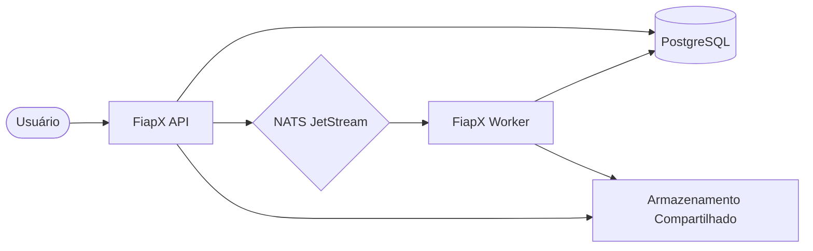
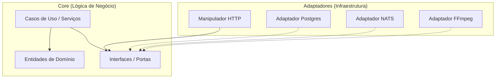
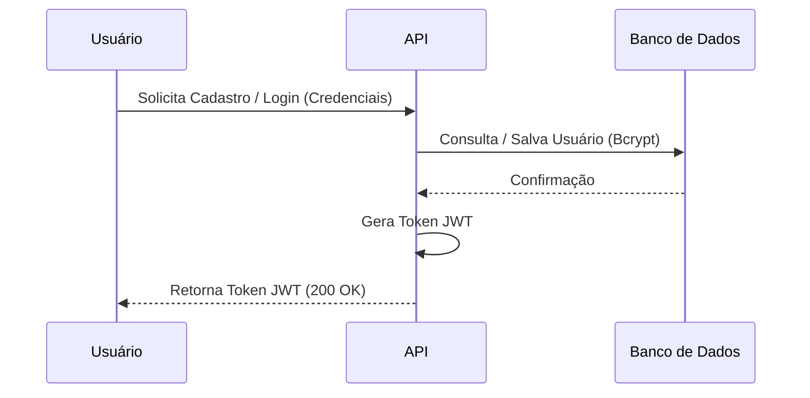
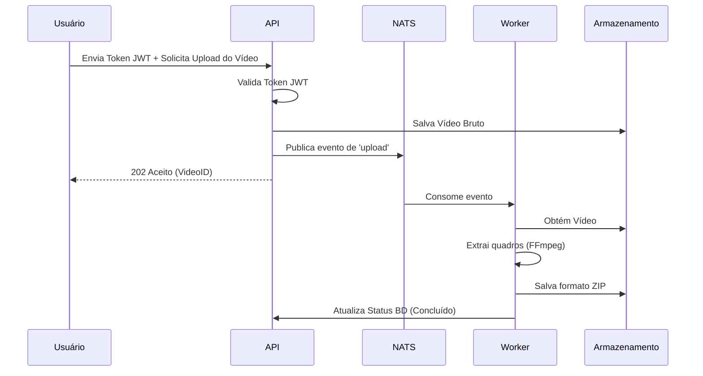

# Documentação de Arquitetura do FiapX

Este documento descreve o design arquitetural, a stack tecnológica e os padrões de comunicação do projeto FiapX, um sistema de processamento de vídeo de alta performance.

## 1. Visão Geral do Sistema

O FiapX é uma aplicação baseada em microsserviços projetada para lidar com uploads de vídeo e processamento assíncrono. Ele permite que os usuários se registrem, façam upload de vídeos e recebam um arquivo ZIP contendo os quadros (frames) extraídos do vídeo.

### Arquitetura de Alto Nível

O sistema é composto por dois serviços principais que se comunicam de forma assíncrona:

---

## 2. Stack Tecnológica

| Componente           | Tecnologia          | Propósito                                    |
| -------------------- | ------------------- | -------------------------------------------- |
| **Linguagem**        | Go (Golang)         | Implementação principal do serviço           |
| **Framework de API** | Gin Gonic           | API REST HTTP                                |
| **Banco de Dados**   | PostgreSQL          | Persistência (Usuários, Vídeos)              |
| **Mensageria**       | NATS JetStream      | Comunicação assíncrona orientada a eventos   |
| **Processamento**    | FFmpeg              | Extração de quadros (frames) do vídeo        |
| **Autenticação**     | JWT e Bcrypt        | Acesso seguro e hash de senhas               |
| **Observabilidade**  | Prometheus e Grafana| Coleta de métricas e painel (dashboard)      |
| **Containerização**  | Docker e Compose    | Orquestração de ambiente                     |

---

## 3. Padrão de Design: Arquitetura Hexagonal

Ambos os microsserviços seguem o padrão de **Arquitetura Hexagonal** (Ports and Adapters) para garantir alta manutenibilidade, testabilidade e desacoplamento de tecnologias externas.

### Camadas da Arquitetura

1.  **Domínio (Core)**: Contém as entidades de negócio (`User`, `Video`) e a lógica pura.
2.  **Serviços (Core)**: Implementa os casos de uso de negócio (`UserService`, `VideoService`, `WorkerService`).
3.  **Portas (Core)**: Define as interfaces para dependências de entrada (Input) e saída (Output).
4.  **Adaptadores (Infraestrutura)**: Implementações específicas das portas (ex: `PostgresRepository`, `NatsPublisher`, `FSStorage`).

---

## 4. Responsabilidades dos Serviços

### FiapX API
- **Autenticação**: Registro e login de usuários.
- **Gerenciamento de Vídeos**: Recebe uploads de vídeo, armazena metadados no banco de dados e salva os arquivos em um armazenamento temporário (staging).
- **Orquestração de Eventos**: Publica um evento de `upload` no NATS após o upload bem-sucedido.
- **Relatório de Status**: Fornece endpoints para os usuários verificarem o progresso do processamento.

### FiapX Worker
- **Consumo de Eventos**: Escuta os eventos de `upload` do NATS JetStream.
- **Processamento de Vídeo**: Baixa o vídeo, utiliza o FFmpeg para extrair os quadros em intervalos específicos.
- **Empacotamento**: Comprime os quadros extraídos em um arquivo ZIP.
- **Notificações**: Notifica o usuário (simulado) em caso de falha no processamento.
- **Atualização de Status**: Atualiza o status do vídeo no banco de dados (Pendente -> Processando -> Concluído/Falhou).

---

## 5. Fluxo de Comunicação

A interação entre os componentes segue um padrão assíncrono para garantir escalabilidade e resiliência.

### Fluxo de Autenticação

### Fluxo de Processamento de Vídeo

---

## 6. Modelo de Dados

O sistema utiliza um esquema relacional no PostgreSQL:

-   **Usuários**: Armazena as credenciais e as informações do perfil.
-   **Vídeos**: Rastreia os metadados do vídeo, a propriedade, o status de processamento (`PENDING`, `PROCESSING`, `COMPLETED`, `FAILED`) e o caminho final do arquivo ZIP.

---

## 7. Estratégia de Armazenamento

Um armazenamento compartilhado é utilizado entre a API e o Worker para minimizar a movimentação de dados.
-   `uploads/`: Armazenamento temporário para vídeos recebidos.
-   `outputs/`: Armazenamento final para os arquivos ZIP processados.
-   `temp/`: Área de trabalho (workspace) para a extração de quadros.

---

## 8. Tratamento de Erros e Resiliência

-   **NATS JetStream**: Fornece assinaturas duráveis e reentrega de mensagens em caso de falha.
-   **Transações de Banco de Dados**: Garante consistência ao atualizar o status do vídeo.
-   **Notificações de Falha**: Os usuários são notificados via e-mail (do lado do worker) se ocorrer um erro de processamento.
-   **Retentativas (Retries)**: Tratadas pela lógica de consumo do NATS para erros transientes.
