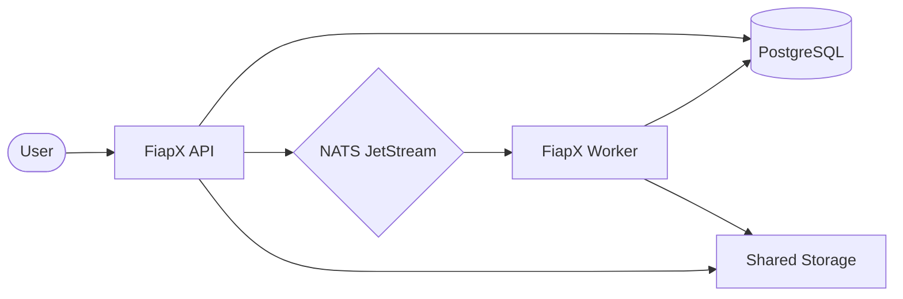
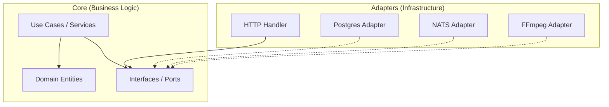
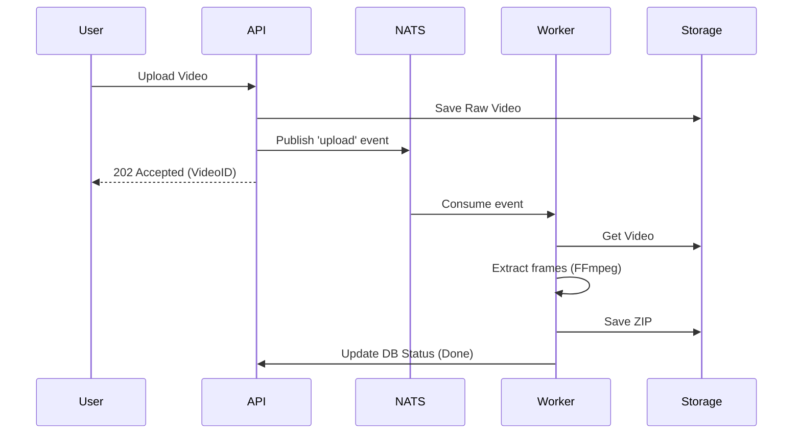

# FiapX Architecture Documentation

This document describes the architectural design, technical stack, and communication patterns of the FiapX project, a high-performance video processing system.

## 1. System Overview

FiapX is a microservices-based application designed to handle video uploads and asynchronous processing. It allows users to register, upload videos, and receive a ZIP file containing extracted frames from the video.

### High-Level Architecture

The system is composed of two main services communicating asynchronously:

---

## 2. Technical Stack

| Component          | Technology          | Purpose                                      |
| ------------------ | ------------------- | -------------------------------------------- |
| **Language**       | Go (Golang)         | Core service implementation                  |
| **API Framework**  | Gin Gonic           | HTTP REST API                                |
| **Database**       | PostgreSQL          | Persistence (Users, Videos)                  |
| **Messaging**      | NATS JetStream      | Asynchronous event-driven communication      |
| **Processing**     | FFmpeg              | Video frame extraction                       |
| **Authentication** | JWT & Bcrypt        | Secure access and password hashing           |
| **Observability**  | Prometheus & Grafana| Metrics collection and dashboard             |
| **Containerization**| Docker & Compose   | Environment orchestration                    |

---

## 3. Design Pattern: Hexagonal Architecture

Both microservices follow the **Hexagonal Architecture** (Ports and Adapters) pattern to ensure high maintainability, testability, and decoupling from external technologies.

### Architecture Layers

1.  **Domain (Core)**: Contains business entities (`User`, `Video`) and pure logic.
2.  **Services (Core)**: Implements business use cases (`UserService`, `VideoService`, `WorkerService`).
3.  **Ports (Core)**: Defines interfaces for inbound (Input) and outbound (Output) dependencies.
4.  **Adapters (Infrastructure)**: Specific implementations of ports (e.g., `PostgresRepository`, `NatsPublisher`, `FSStorage`).

---

## 4. Services Responsibilities

### FiapX API
- **Authentication**: User registration and login.
- **Video Management**: Receive video uploads, store metadata in DB, and save files to staging storage.
- **Event Orchestration**: Publish an `upload` event to NATS after successful upload.
- **Status Reporting**: Provide endpoints for users to check processing progress.

### FiapX Worker
- **Event Consumption**: Listen for `upload` events from NATS JetStream.
- **Video Processing**: Download the video, use FFmpeg to extract frames at specific intervals.
- **Packaging**: Compress extracted frames into a ZIP file.
- **Notifications**: Notify the user (simulated) in case of processing failure.
- **Status Update**: Update the video status in the database (Pending -> Processing -> Completed/Failed).

---

## 5. Communication Flow

The interaction between components follows an asynchronous pattern to ensure scalability and resilience.

---

## 6. Data Model

The system uses a relational schema in PostgreSQL:

-   **Users**: Stores credentials and profile info.
-   **Videos**: Tracks video metadata, ownership, processing status (`PENDING`, `PROCESSING`, `COMPLETED`, `FAILED`), and the final ZIP path.

---

## 7. Storage Strategy

Shared storage is used between the API and Worker to minimize data movement. 
-   `uploads/`: Temporary storage for incoming videos.
-   `outputs/`: Final storage for the processed ZIP files.
-   `temp/`: Workspace for frame extraction.

---

## 8. Error Handling & Resilience

-   **NATS JetStream**: Provides durable subscriptions and message redelivery on failure.
-   **Database Transactions**: Ensures consistency when updating video status.
-   **Failure Notifications**: Users are notified via email (worker-side) if a processing error occurs.
-   **Retries**: Handled by the NATS consumer logic for transient errors.
